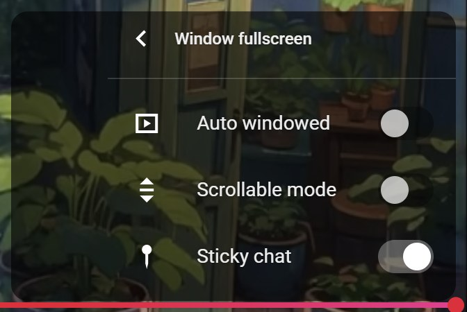
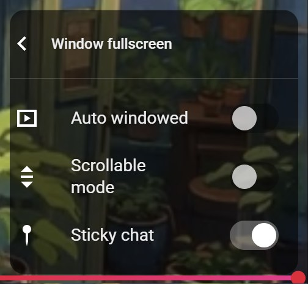
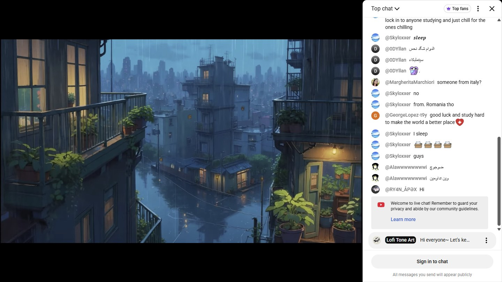
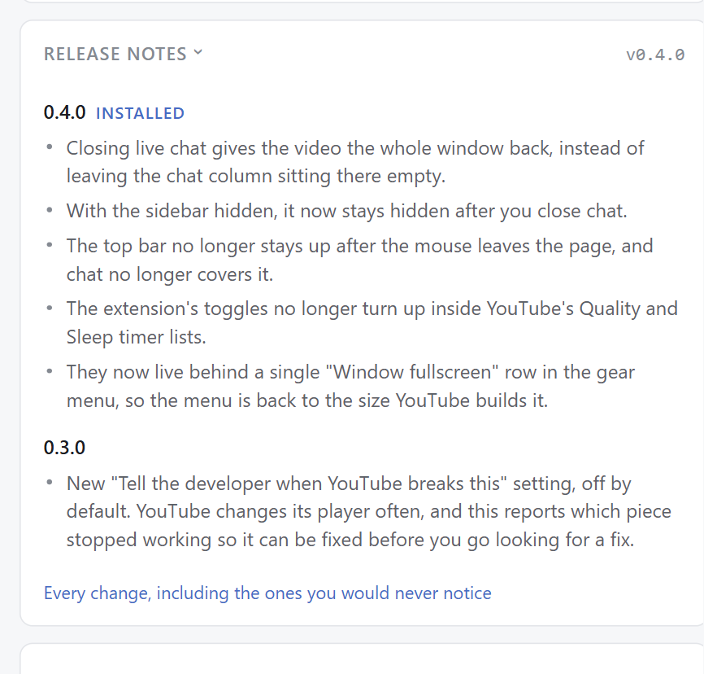

# Changelog

All notable changes to this project will be documented in this file.

The format is based on [Keep a Changelog](https://keepachangelog.com/en/1.1.0/),
and this project adheres to [Semantic Versioning](https://semver.org/spec/v2.0.0.html).

## [Unreleased]

### Fixed
- **The buttons now work on a stream that has not started yet.** A scheduled stream sits on
  a waiting slate with a countdown, and chat is already running, which is exactly when
  someone wants the window set up before the stream begins. YouTube takes its control bar
  down to `display: none` there, because there is nothing to control, so the two buttons
  injected into it were present but zero pixels wide and there was no way to enter windowed
  fullscreen except the hotkey. While the bar is down they move onto the player's top-right
  corner instead, and they move back into the bar the moment YouTube puts it up. The same
  applies to the slate a stream leaves behind when it ends. The check reads the bar's
  computed display rather than the player's state classes, so it holds for whatever slate
  YouTube adds next.
- **A false break report on those pages.** The health check measures the injected button and
  reports a zero-width one as broken, so every waiting-stream page told the developer that
  YouTube had changed something. It has a real button to measure now.
- **Auto windowed no longer fires outside a watch page.** It watched the `<video>` source
  for a change and treated any new one as a new video to watch, and Shorts play through the
  same element, so scrolling the Shorts feed with the setting on turned windowed fullscreen
  on over it. The extension then spent fifteen clicks trying to put a shorts player into
  theater mode and reported the failure, which was most of the second-largest error in the
  tracker. It now waits for a watch page.

## [0.4.0] - 2026-08-25

<table>
<tr>
<td width="50%"></td>
<td width="50%"></td>
</tr>
<tr>
<td>One row in YouTube's menu, not three.</td>
<td>It opens a panel built from YouTube's own markup.</td>
</tr>
<tr>
<td></td>
<td></td>
</tr>
<tr>
<td>Closing chat now gives the video the whole window back.</td>
<td>Release notes in the popup, collapsed by default.</td>
</tr>
</table>

Screenshots are generated by `npm run capture` and live in
[`docs/screenshots/`](docs/screenshots/), one folder per version.

### Added
- **`npm run capture`**, which generates the release screenshots instead of someone taking
  them by hand and forgetting to redo one. It launches a throwaway Chrome, loads the repo
  as an unpacked extension, drives it through six scenarios (popup, release notes,
  windowed fullscreen, sticky chat, masthead reveal, gear menu) and writes each one cropped
  to the element it is about, so the output is the extension and the player rather than a
  desktop. Results go to `docs/screenshots/<version>/` and stay in the repo: nothing ships
  in the package, so there is no install-size cost and the popup never fetches anything
  remote. No dependencies; it uses node's own WebSocket and the Chrome DevTools Protocol.
  A scenario that cannot run is named and the run exits non-zero rather than quietly
  producing a short set.
- **A "Release notes" section in the popup**, listing every release's highlights, newest
  first, with the installed version marked. Collapsed by default: a popup is capped at
  800px tall before it starts scrolling in a cramped box, and this list only grows. It
  reads the same entries as the update notice, so there is one place to write user-facing
  release copy, and it links out to the full changelog for everything else. Versions
  written up before their manifest bump ships are withheld rather than announced early.
- **A "what's new" notice in the popup.** Extensions update silently, so the first anyone
  hears of a change is usually the change itself. The toolbar icon now gets a dot after an
  update, and the popup shows the highlights for the versions that were missed. It is
  shown once: opening the popup clears it, the X closes it immediately, and it links to
  the full changelog. Highlights live in `whatsnew.js`, written for someone with thirty
  seconds rather than someone reading the repo; a release with nothing user-visible gets
  no entry and the notice falls back to "Updated to X". The seen-marker is kept in
  `storage.local` rather than `sync`, so a second machine that has not updated yet still
  gets its own notice.
- **`npm test`** (`node --test`, no dependencies) covering the version arithmetic behind
  that notice: fresh installs, skipped releases, downgrades, and entries written before
  the matching manifest bump ships. Wired into CI ahead of lint and build. `package.json`
  is repo tooling only; the extension still has no build step and no runtime dependencies.

### Changed
- **The three gear-menu toggles moved into a submenu of their own.** YouTube's settings
  menu now carries one "Window fullscreen" row that opens a panel with the toggles inside,
  built from YouTube's own panel, header and back-button markup so it looks like the ones
  next to it. Three rows inline had nearly doubled the height of the top-level menu and put
  a scrollbar on it, and the widest of them set the width of the whole menu including every
  submenu opened from it. The panel measures its own width from the label text, because
  YouTube's CSS pins a panel to the popup width and neither `max-content` nor a roomier
  popup makes it report what it needs.
- **The manifest description no longer uses an em dash**, which is store-listing copy on
  both AMO and the Chrome Web Store. The clause that followed "windowed fullscreen" is now
  introduced with a colon.
- **The hotkey is recorded instead of typed.** The setting is now a keycap you click and
  then press the combination for, the way a game rebinds a key. A field people type into
  invites `Ctrl-Shift-F` and `control+f`, spellings that parse to nothing and then fail
  silently on the page. Modifiers alone are ignored while recording, `Esc` cancels, and
  `Tab` and `Space` are refused.
- **Popup and options page redesigned.** Settings are grouped into cards, toggles are real
  switches, and each option carries its explanation on the row instead of in a detached
  paragraph below it. The whole page is driven by colour tokens and now follows the
  system light/dark preference rather than forcing dark, with visible focus rings
  throughout and animation dropped under `prefers-reduced-motion`.
- Dropped the `wfs-chat-available` marker class from `<html>`. Nothing reads it any more
  now that the sidebar rules key off whether chat is actually showing, and a class that is
  set but never read is a class that will eventually be believed.

### Fixed
- Closing live chat (or chat replay) from YouTube's own close button left the chat column
  reserved: the player box widened back but the video kept the size it had while chat was
  open, so the old chat area stayed black. Chat visibility is now re-derived on every
  layout pass rather than only from the `collapsed` attribute, which YouTube does not
  always set, and a resize is dispatched once the width transition has settled so the
  player refits.
- With "hide sidebar" on, the sidebar stayed visible whenever a chat frame existed, even
  after chat was closed. It now keys off whether chat is actually showing.
- The masthead stayed revealed after the pointer left the page through the top of the
  window. `mousemove` stops firing there, so nothing ever told it to hide again; brushing
  past the top edge pinned the bar open for the rest of the video. It now times out
  shortly after the pointer leaves, and a search you have actually clicked into still
  keeps it up.
- Leaving windowed fullscreen no longer leaves the reveal latched, which used to show the
  masthead the next time it was entered.
- Sticky chat painted over the masthead. The chat panel is fixed at a higher stacking
  order than YouTube's top bar, so revealing the bar brought it back with its right-hand
  side (account, notifications, Create) hidden behind chat, and with "hide masthead" off
  it was covered permanently. The masthead now sits above chat while windowed fullscreen
  is on.
- **The extension's three toggles leaked into YouTube's submenus.** Open Quality or Sleep
  timer and "Auto windowed", "Scrollable mode" and "Sticky chat" were sitting at the
  bottom of the list, stretching the panel and adding a scrollbar. YouTube's settings menu
  swaps panels through a single container rather than keeping them side by side, so
  `.ytp-panel-menu` resolves to whichever panel is on screen: opening a submenu made the
  "have we already injected?" check look at the wrong panel, find nothing, and append
  another copy there. Injection now targets the top level specifically (a submenu carries
  a back-button header, the top level does not) and sweeps up any rows that ended up
  elsewhere.
- The gear-menu row is now "Auto windowed" rather than "Auto window fullscreen". YouTube
  sizes the settings panel to its widest item, and the old label was half again as wide as
  YouTube's own longest, which stretched the whole menu. The unabbreviated name is still
  on the options page.

## [0.3.0] - 2026-07-31

### Added
- **Opt-in breakage reporting**, off by default, behind a new "Tell the developer when
  YouTube breaks this" toggle. YouTube changes its player markup regularly, and when it
  does the extension fails silently: every DOM lookup is guarded, so a renamed class makes
  the button quietly stop appearing rather than throw. A health check now runs 15s after
  each watch-page navigation, verifies the selectors the extension depends on plus the
  button it injected, and reports which ones stopped holding. Deferred while an ad is
  playing, while the tab is hidden, or before the player has mounted, so a slow load is
  never mistaken for breakage.
- Reports go to a self-hosted GlitchTip (`glitchtip.dorzairi.com`) and are fingerprinted by
  what broke, so one YouTube change is one issue no matter how many users hit it. Firefox
  additionally gates the whole thing behind the built-in `technicalAndInteraction` consent,
  revocable in `about:addons`. No page URL, video ID, typed text, or IP address is included,
  and the per-install extension origin is stripped from stack frames because it identifies
  a device.
- Exceptions thrown by the extension's own code are reported through the same path as a
  secondary signal. Implemented as ~130 lines in `errors.js` + `background.js`; no SDK, no
  build step, no new runtime dependency.
- Background event page / service worker (`background.js`). It owns the consent check, since
  `chrome.permissions` is not reachable from a content script, and it makes the network call
  from the extension origin so YouTube's CSP does not apply.

### Changed
- Every YouTube selector the extension relies on now lives in one `SEL` map in `content.js`,
  so the health check and the code being checked cannot drift apart.
- `data_collection_permissions` now declares `optional: ["technicalAndInteraction"]`.
  `required` stays `["none"]`, so existing installs get no new permission prompt on update.
- Privacy policy rewritten to describe breakage reporting, what a report contains, what it
  never contains, and both ways to turn it off.
- Chrome Web Store listing is now live and approved. README and docs link directly to the
  store listing (and a Chrome Web Store version badge was added), replacing the
  "submitted / pending review" note.

## [0.2.6] - 2026-05-26

First AMO update since 0.2.3. The fixes tagged as 0.2.4 and 0.2.5 never reached the store — the old tag-based AMO upload ran with `continue-on-error: true` and failed silently. This release carries them to users.

### Fixed
- **Player-control SVG icons not rendering** for live AMO users. The published 0.2.3 has the 0.2.2 `innerHTML` → `DOMParser` switch but lacks the 0.2.4 follow-up, so `parseSvg` mis-parsed SVG namespacing and the button icons came out blank. Now parsed as `text/html`.

### Changed
- Release pipeline publishes to Firefox (AMO) then Chrome Web Store automatically on a `manifest.json` version bump merged to `main`, replacing manual `v*` tag uploads.

## [0.2.5] - 2026-05-22

First release with a Mozilla-signed `.xpi` attached to the GitHub Release — installable directly in regular Firefox without waiting for AMO listing approval.

### Added
- `web-ext.config.cjs` so lint/build commands no longer need `--ignore-files` flags
- `CHANGELOG.md` (Keep a Changelog format)
- README badges (CI status, latest release, license)
- GitHub issue templates (bug report, feature request) + Discussions link
- `.github/FUNDING.yml` (Sponsor button: GitHub Sponsors + Ko-fi)
- `CONTRIBUTING.md` documenting the dev/main branch strategy
- CI workflow that lints + builds on every push and, on `v*` tag push:
  - **`sign-unlisted`** — runs `web-ext sign --channel=unlisted`, attaches the Mozilla-signed `.xpi` to the GitHub Release. This is the user-facing installer.
  - **`deploy-amo-listed`** — runs `web-ext sign --channel=listed` to publish on AMO. `continue-on-error: true` since this fails when a version is already in AMO's review queue from a manual upload.
  - **`release-zip`** — attaches the unsigned `.zip` (source bundle) to the GitHub Release for developers and inspection.
- `AMO_JWT_ISSUER` / `AMO_JWT_SECRET` GitHub Secrets wired up to the workflow.

### Changed
- README install section reflects AMO-pending state and points users to the signed `.xpi` on GitHub Releases as the install source until the AMO listing is approved.

## [0.2.4] - 2026-05-22

### Fixed
- SVG icons not rendering after the v0.2.2 `innerHTML` → `DOMParser` switch. `parseSvg` now uses `text/html` mime type so the HTML parser handles SVG namespacing automatically.

## [0.2.3] - 2026-05-22

### Fixed
- AMO submission rejection (`data_collection_permissions property is missing`). The key is now declared at both top-level and inside `browser_specific_settings.gecko` to satisfy both AMO's upload validator and `web-ext lint`.

## [0.2.2] - 2026-05-22

### Changed
- Replaced `innerHTML` SVG injection with `DOMParser` + `appendChild` (silences AMO's static-analysis `UNSAFE_VAR_ASSIGNMENT` warnings).
- Declared `data_collection_permissions = ["none"]` to satisfy AMO's new policy.
- Bumped `strict_min_version` to 142.0 (when `data_collection_permissions` key was introduced).

## [0.2.1] - 2026-05-22

### Added
- Real Ko-fi ([ko-fi.com/dorzairidev](https://ko-fi.com/dorzairidev)) and GitHub Sponsors ([github.com/sponsors/MashdorDev](https://github.com/sponsors/MashdorDev)) links in the options popup, styled as branded buttons with each platform's SVG logo and brand hover color.

## [0.2.0] - 2026-05-22

First feature-complete release.

### Added
- Settings infrastructure backed by `chrome.storage.sync`
- Three native-styled toggles inside YouTube's gear menu: auto window fullscreen, scrollable mode, sticky chat
- Full options page (toolbar icon popup) with hotkey input, behavior toggles, granular hide toggles, reset-to-defaults
- Configurable hotkey (default `Shift+F`), `Esc` to exit
- Auto-toggle on each new video (optional)
- Scrollable mode — body remains scrollable, page chrome visible below the player
- Live chat side-panel with draggable resize handle. Sticky (pinned right) and non-sticky (scrolls with page) modes
- Hover-to-reveal masthead (search bar fades in at top edge)
- Smooth fullscreen transitions (0.18s ease-out) with `prefers-reduced-motion` guard
- Extension icons at 16/32/48/128 px
- Toolbar action button + popup options

### Changed
- Player layout approach: replaced `position: fixed` on `.html5-video-player` with theater-mode + `height: 100vh` on `#movie_player`. Works WITH YouTube's layout instead of fighting it.

## [0.1.0] - 2026-05-22

### Added
- Initial prototype
- Native button injection into YouTube's player controls
- Hardcoded `Shift+F` hotkey
- `Esc` to exit
- SPA navigation handling
- MV3 manifest, MIT license
