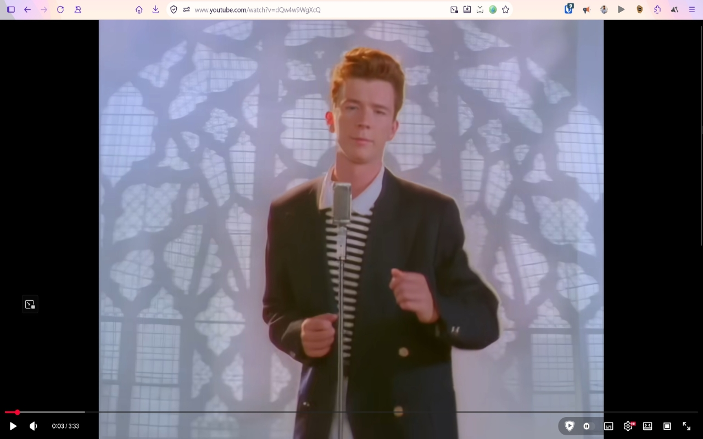
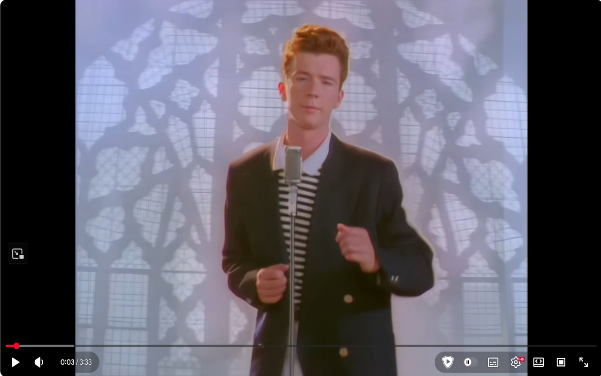
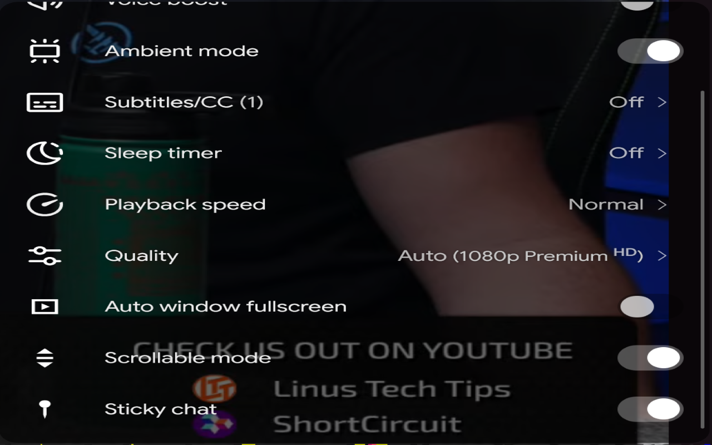
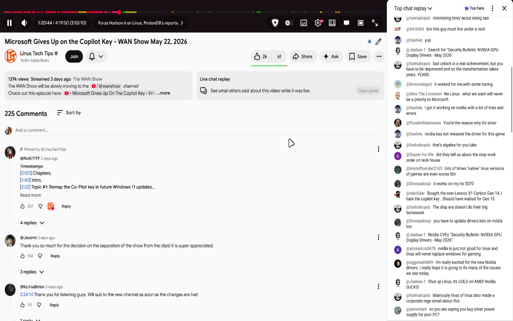
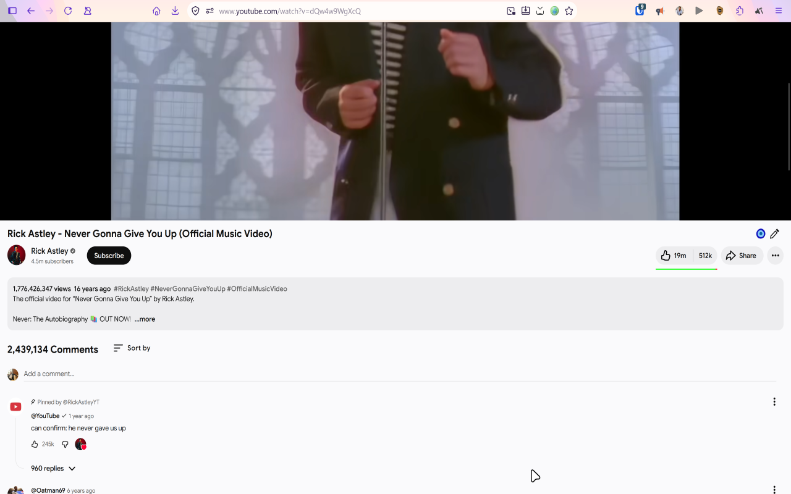
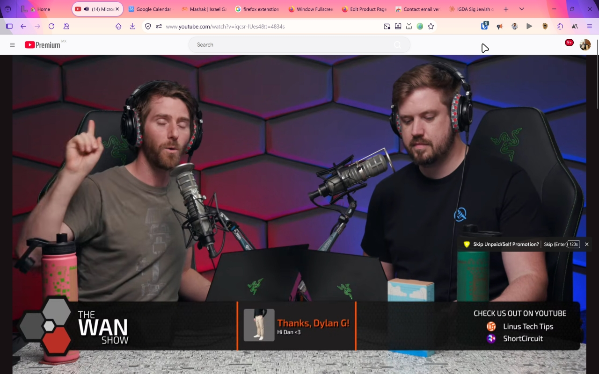
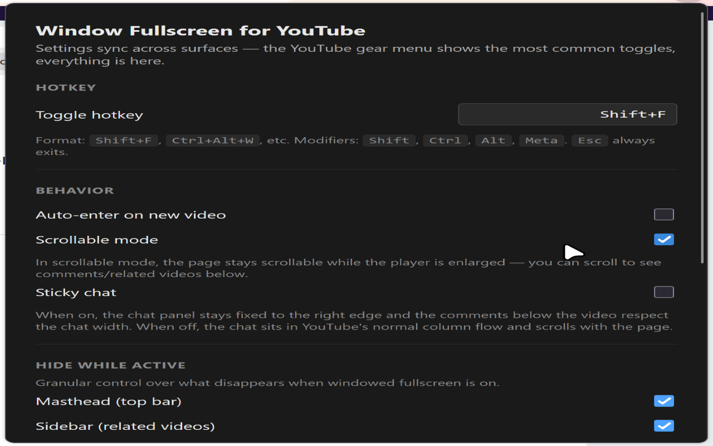

# Window Fullscreen for YouTube

A free, open-source Firefox + Chrome extension that gives YouTube a real windowed-fullscreen mode — the player fills the browser window without going OS-level fullscreen.

Built for ultrawide and dual-monitor users who lose real estate to YouTube's letterboxing in native fullscreen, and for anyone who wants a bigger player while keeping the browser chrome accessible.

## Showcase

  

<em>Windowed fullscreen: the player fills the whole browser window — no OS-level fullscreen, so your tabs, address bar, and taskbar stay put.</em>

| | |
|:---:|:---:|
|  |  |
| **Native player button** — added right into YouTube's control bar, not a floating widget. | **Gear-menu toggles** — the common options live inside YouTube's own settings menu. |
|  |  |
| **Sticky chat** — live chat pinned to the right edge, with a draggable resize handle. | **Scrollable mode** — keep the player large and scroll down to comments. |
|  |  |
| **Hover-to-reveal masthead** — the search bar fades in at the top edge. | **Options page** — configurable hotkey and granular show/hide controls. |

## Features

- **Native player button** in YouTube's own control bar — not a toolbar popup, not a floating widget
- **Configurable hotkey** (default `Shift+F`), `Esc` to exit
- **Auto-toggle** on new video (optional)
- **Scrollable mode** — keep scrolling past the player to reach comments and related videos
- **Granular page-chrome hiding** — toggle masthead, sidebar, comments independently
- **Hover-to-reveal masthead** — search bar fades in when you move the cursor to the top edge
- **Live chat side-panel** — dedicated chat toggle button on live/post-live videos with a draggable resize handle. Choose sticky chat (always pinned to right) or non-sticky (scrolls with the page)
- **Native YouTube integration** — three toggles inside YouTube's gear menu, styled to match
- **Smooth transitions** that respect `prefers-reduced-motion`

Every feature is free, forever — no paywall, no subscription, no nag prompts. Open source (MIT). Zero runtime dependencies, no build step.

## Install

**Firefox:** [Install from Mozilla Add-ons](https://addons.mozilla.org/en-US/firefox/addon/window-fullscreen-for-youtube/) — reviewed and listed on AMO.

**Chrome:** Chrome Web Store submission in progress. Until it's live, load it unpacked (see below) or grab the `.zip` from [Releases](https://github.com/MashdorDev/window-fullscreen-for-youtube/releases/latest).

### Development install — Firefox

1. Clone this repo
2. Open `about:debugging` → "This Firefox" → "Load Temporary Add-on"
3. Select `manifest.json` from the cloned folder

### Development install — Chrome

1. Clone this repo
2. Open `chrome://extensions`, enable Developer mode
3. Click "Load unpacked", select the cloned folder

## Documentation

Full docs — user guide, architecture, release process, and privacy policy — live at
**[docs.dorzairi.com](https://docs.dorzairi.com/docs/6bd59cc4-58fa-4c62-aca2-4c74c2c4aa95/)**,
with the markdown source under [`docs/`](./docs) in this repo.

- [User Guide](https://docs.dorzairi.com/docs/db7a214e-9481-4f93-b30b-8f4b62e50166/)
- [Privacy Policy](https://docs.dorzairi.com/docs/5a8eb82d-4734-4ca3-8a4c-7d19c06787ce/)
- [Architecture](./docs/architecture.md)
- [Release & CI](./docs/release-and-ci.md)

## Why this exists

The incumbent extension (YouTube Windowed FullScreen by navi.jador) pioneered the windowed-fullscreen pattern but moved core features behind a paywall in v4.7. The community noticed — the AMO reviews are bimodal, split between users who love the feature and users who feel rug-pulled. This extension ships every previously-paid feature for free, with the source open for inspection.

## Settings

Open settings by clicking the toolbar icon (after pinning the extension), or use the three toggles directly inside YouTube's gear menu:

| Setting | Default | Description |
|---|---|---|
| `hotkey` | `Shift+F` | Toggle hotkey, modifier combos supported (e.g. `Ctrl+Alt+W`) |
| `autoToggle` | off | Auto-enter windowed fullscreen on each new video |
| `scrollableMode` | off | Allow scrolling beneath the player to reach comments |
| `stickyChat` | on | Pin chat to the right edge (live videos); off = chat scrolls with page |
| `hideMasthead` | on | Hide YouTube's top bar (hover to reveal) |
| `hideSidebar` | on | Hide related videos sidebar (ignored on live videos so the chat stays accessible) |
| `hideComments` | on | Hide comments (ignored in scrollable mode) |

## Support

This extension is free and will stay free. If it's useful to you, consider supporting development:

- [GitHub Sponsors](https://github.com/sponsors/MashdorDev)
- [Ko-fi](https://ko-fi.com/dorzairidev)

## Contributing

See [CONTRIBUTING.md](./CONTRIBUTING.md). Active development happens on the `dev` branch; `main` is branch-protected and is what gets published to the stores.

## License

MIT — see [LICENSE](./LICENSE)
